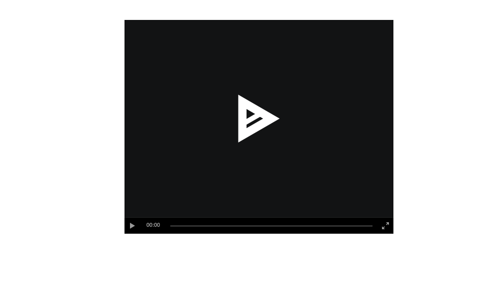

<!-- README.md is generated from README.Rmd. Please edit that file -->

# rsciinema

The goal of rsciinema is to provide an R analog to asciinema
<https://asciinema.org/> with the correct highlighting and output, with
bindings for Shiny and RMarkdown. \#\# Installation

You can install the released version of rsciinema from
[CRAN](https://CRAN.R-project.org) with:

``` r
remotes::install_github("romainfrancois/rsciinema")
```

## Example

This is a basic example of making an output scene:

``` r
library(rsciinema)
data = asciicast( "library(magrittr)\n# a comment\niris %>% \n  dplyr::group_by(Species) %>%\n  dplyr::summarise_all(mean) \n # a new line" )
asciinema(data = data)
```


You can also write out the file

``` r
tfile = tempfile(fileext = ".cast")
write_asciicast(data, tfile)
asciinema( tfile )
```


### Using backspaces

You can encode typos if youwant was well

``` r
library(rsciinema)
input = paste0("# a comment is a gra", backspace(), "eat thing to do", 
           "\niris %>% \n  dplyr::group_by(Species) %>%\n ", 
           "dplyr::summarise_all(mean) \n # a new line")
data = asciicast( input )
```

Fixing the backspace

``` r
asciinema(data = data)
```


``` r
fixed_data = data
fixed_data$text[21] = backspace()
fixed_data$text[22:24] = ""
asciinema(data = fixed_data)
```


